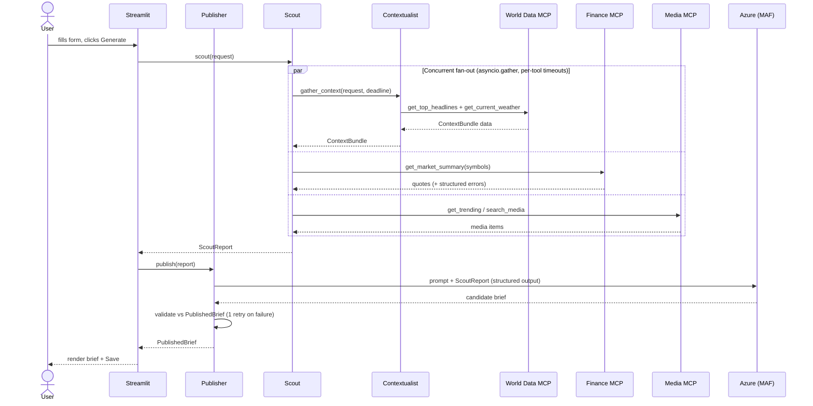

# News Brief Generator — MCP + A2A

A small, production-shaped multi-agent system that generates a daily news brief from live data. It is
a **learning project**: deliberately tiny, but built with the patterns you'd defend in a real
agentic system — a decoupled tool layer, typed agent-to-agent contracts, a single isolated LLM call,
and validation at every boundary.

---

## 1. What this is

Given a topic, region, and audience, the app produces a concise, sourced news brief by:

1. Pulling **live data from four domains** — news, weather, finance, media — each behind its own
   **MCP server** over HTTP.
2. Coordinating **three agents** (Contextualist, Scout, Publisher) through an explicit **A2A
   message-passing protocol** (typed Pydantic contracts, never loose dicts).
3. Synthesising the article with **one LLM call** (Azure AI Foundry via the Microsoft Agent
   Framework) using structured output + prompt-injection defence.
4. Rendering it in a **Streamlit** UI with progress feedback, grouped sources, save, and a
   regenerate-with-tweaks loop.

It is intentionally a *slice*: no auth, no database, no deployment. The point is the architecture and
the decisions, not the feature set.

---

## 2. How it works

Four concerns are kept strictly apart, and data flows in one direction:

- **Tool layer (`servers/`)** — three stateless MCP servers, each wrapping one external API,
  normalising its output to validated Pydantic models. They don't interpret. Errors come back as
  *data* (structured error entries / partial success), never as a 500.
- **Coordination layer (`agents/`)** — stateless-per-invocation agents that fan out, aggregate, and
  hand off. The Contextualist gathers news+weather; the Scout aggregates everything; the Publisher
  synthesises.
- **Synthesis** — the Publisher is the **only** component that calls the LLM.
- **Presentation (`app/`)** — Streamlit triggers the work and renders the result. The UI is the
  orchestrator: it calls `scout(request)` then `publish(report)`; the two agents never call each other.

### Architecture (from [docs/ARCHITECTURE.md](docs/ARCHITECTURE.md))


### Request lifecycle

Note the concurrency: the Scout fans out and waits on everything together, under one time budget it
passes down so nested timeouts don't compound. One slow/failed upstream degrades to an empty section,
never a crash.



---

## 3. How to run it

**Prerequisites:** [`uv`](https://docs.astral.sh/uv/) and Python 3.12. API keys for NewsAPI,
OpenWeatherMap, Finnhub, YouTube Data API v3, and an Azure OpenAI deployment (see the key table in the
"API keys" section below — links + free tiers).

```bash
# 1. Install dependencies from the lockfile
uv sync

# 2. Configure secrets
cp .env.example .env          # then fill in your real keys
uv run python scripts/check_keys.py    # verifies presence (never prints values)
```

```bash
# 3. Start the three MCP servers, one per terminal
uv run python -m servers.world_data_server   # :8801  get_top_headlines, get_current_weather
uv run python -m servers.finance_server      # :8802  get_quote, get_market_summary
uv run python -m servers.media_server        # :8803  get_trending, search_media

# 4. Launch the UI (in a fourth terminal)
uv run streamlit run app/streamlit_app.py
```

```bash
# Tests (no servers or keys needed — every external call is mocked at one seam)
uv run pytest tests/
```

### API keys — where to get each

| Service | `.env` variable(s) | Where | Free tier |
|---|---|---|---|
| NewsAPI.org | `NEWSAPI_KEY` | [newsapi.org/register](https://newsapi.org/register) | 100 req/day, dev key localhost-only |
| OpenWeatherMap | `OPENWEATHER_API_KEY` | [openweathermap.org/api](https://openweathermap.org/api) | 60/min (key can take ~2h to activate) |
| Finnhub | `FINNHUB_API_KEY` | [finnhub.io/register](https://finnhub.io/register) | 60/min |
| YouTube Data API v3 | `YOUTUBE_API_KEY` | [Google Cloud Console](https://console.cloud.google.com/) → enable API → API key | 10,000 units/day (`search`=100, `videos`=1) |
| Azure OpenAI | `AZURE_OPENAI_ENDPOINT`, `AZURE_OPENAI_API_KEY`, `AZURE_OPENAI_CHAT_DEPLOYMENT`, `AZURE_OPENAI_API_VERSION` | [Azure AI Foundry](https://ai.azure.com/) | pay-per-token |

---

## 4. Learning path

The project was built strictly task-by-task (0 → 11). Replicate it in the same order — each task is a
self-contained lesson that builds on the last.

| Task | What you build | Key skills & patterns |
|---|---|---|
| **0** | Project scaffold | `uv` + lockfile reproducibility; `.env` vs `.env.example`; dependency-resolution pitfalls (pre-release leakage) |
| **1** | API key plumbing | Secrets hygiene; presence-checking without leaking values; rate-limit / quota awareness |
| **2** | World Data MCP — news tool | Building an MCP server/tool; Pydantic validation at the boundary; **errors-as-data**; key-in-header |
| **3** | Weather tool | Server-side normalisation (the unit trap); provider auth asymmetry; scalar-vs-list error semantics |
| **4** | Finance MCP | Independent server; **partial success** via a discriminated union; `Decimal` for money; fan-out |
| **5** | Media MCP | Deterministic truncation; quota-unit economics; batch vs fan-out; designing tool output for the LLM |
| **6** | A2A contracts | **Typed messages, not dicts**; generic `AgentMessage[T]`; frozen models; region resolver; additive evolution |
| **7** | Contextualist agent | Concurrent fan-out (`asyncio.gather`); **graceful degradation**; passed-down deadline; no LLM in the data layer |
| **8** | Scout agent | Aggregation; **budget ownership**; LLM-free selection policy; failure isolation |
| **9** | Publisher agent | The **one LLM call**; structured output; **prompt-injection defence**; corrective retry; source integrity |
| **10** | Streamlit UI | Orchestration; the rerun model + async; `session_state`; staged progress feedback |
| **11** | Readability polish | Rendering typed structure; trust signals; regenerate-without-refetch; presentational vs editorial polish |

> Each task in the original build also produced two deep-dive lesson files (a senior-level analysis and
> a beginner-friendly companion). Those `lessons/` live locally and are not published — but the table
> above is the map of what each step teaches.

---

## 5. Key takeaways — what you'll actually learn

If you replicate this, these are the ideas that transfer to real agentic systems:

- **MCP as a decoupled tool layer.** Tools are dumb, stateless wrappers that normalise and validate;
  they never interpret. Swapping a provider touches one server, not the whole stack.
- **A2A as typed coordination.** The Pydantic contracts in [`agents/contracts.py`](agents/contracts.py)
  *are* the API between agents. Designing messages that survive refactors is the real skill — not the
  transport. (This is hand-rolled in-process; the full MAF A2A protocol over HTTP is the next step
  *only when a real distribution boundary exists*.)
- **One isolated LLM call.** Keeping the model in a single component makes the rest deterministic,
  testable, and cheap — and concentrates cost, non-determinism, and prompt-injection risk in one place
  you can harden.
- **Validate at every boundary.** API → MCP → Agent → LLM → UI, each with Pydantic v2. Bad data is
  rejected early with a clear error instead of leaking forward.
- **Errors are data; degrade gracefully.** Tools return structured errors / partial success; agents
  fan out under a bounded, non-compounding time budget; one upstream failing yields an empty section,
  never a crash.
- **Treat upstream text and LLM output as untrusted.** Headlines are delimited as DATA with explicit
  injection defence; the LLM's output is schema-validated with a corrective retry; sources are derived
  from real data, never invented by the model.
- **Separate gathering from synthesis.** Because the Scout (gather) and Publisher (synthesise) are
  distinct, "make it shorter / longer / for a different audience" re-runs only the LLM step on cached
  data — no re-fetch.
- **Know where it breaks under load.** Synchronous request lifecycle, no caching, per-process
  `asyncio` fan-out, a single LLM call with one retry — all fine for a toy, all the exact decision
  points you'd revisit with a job queue, a cache, and connection pooling at scale. (See
  [docs/ARCHITECTURE.md §7](docs/ARCHITECTURE.md).)

**Two deliberate deviations** from a textbook build, both documented: the toolchain is `uv` (not
`pip`), and the LLM is **Azure AI Foundry via the Microsoft Agent Framework, adopted Publisher-only**
— which preserves the single-LLM-call invariant while still leveraging MAF for synthesis.

See [docs/PRD.md](docs/PRD.md) for the full task specifications and [docs/ARCHITECTURE.md](docs/ARCHITECTURE.md)
for the deep architectural rationale.
