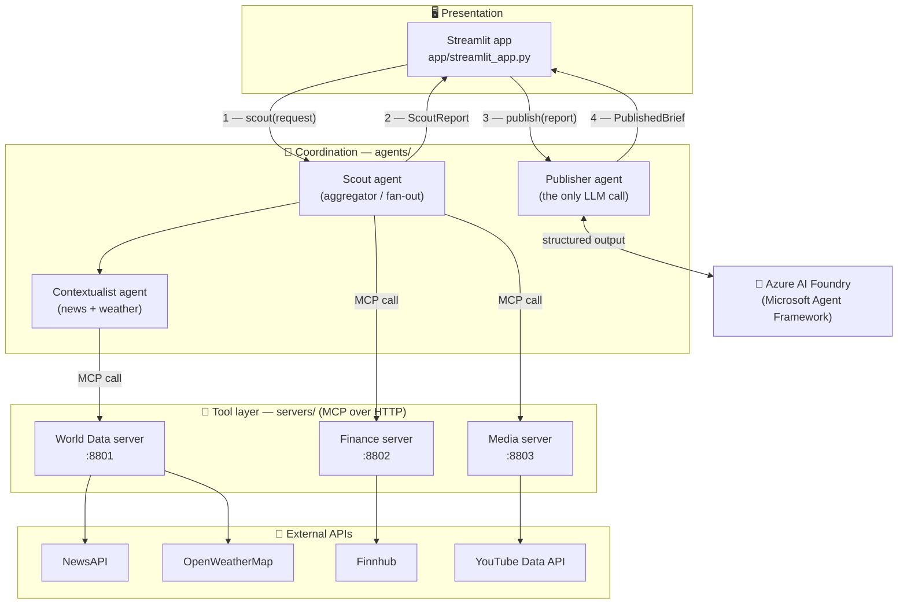
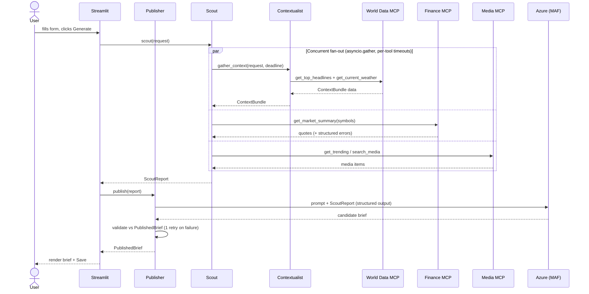

<div align="center">

# 📰 News Brief Generator

### Multi-Agent Daily News Briefs — **MCP Tools** · **A2A Agents** · **One LLM Call**

*A production-shaped, learn-by-building agentic system. Tiny on purpose — every line is a decision you'd defend in a real architecture review.*

<br/>


<br/>

**⭐ If this helps you learn agentic architecture, please [star the repo](https://github.com/Bhardwaj-Saurabh/news-brief-generator-A2A) — it genuinely helps others find it.**

[🚀 Quickstart](#-quickstart) · [🏗️ Architecture](#️-how-it-works) · [🧠 Learning Path](#-learning-path) · [💡 Key Takeaways](#-key-takeaways)

</div>

---

## ✨ What is this?

Give it a **topic**, **region**, and **audience** — it returns a concise, **sourced** news brief by:

| Step | What happens |
|------|--------------|
| 1️⃣ **Gather** | Pulls live data from **four domains** — 📰 news, 🌤️ weather, 📈 finance, 🎬 media — each behind its own **MCP server** over HTTP |
| 2️⃣ **Coordinate** | Three **agents** talk via an explicit **A2A protocol** (typed Pydantic contracts, never loose dicts) |
| 3️⃣ **Synthesise** | **One** LLM call (Azure AI Foundry via Microsoft Agent Framework) with structured output + prompt-injection defence |
| 4️⃣ **Present** | A **Streamlit** UI with live progress, grouped sources, save, and a regenerate-with-tweaks loop |

> 🎯 It's a *slice*, not a product — no auth, no database, no deploy. The value is the **architecture and the decisions**, which is exactly what makes it a great thing to replicate.

---

## 🧩 Tech Stack

| Layer | Technology | Role |
|-------|-----------|------|
| 🧰 **Tool layer** | `FastMCP 3.x` (HTTP transport) | Three stateless MCP servers, one per data domain |
| 🌐 **HTTP client** | `httpx` (async) | Timeout-bounded calls to every upstream API |
| 🧾 **Validation** | `Pydantic v2` | Typed models validated at **every** boundary |
| 🤝 **Coordination** | Custom **A2A contracts** | Typed agent-to-agent messages (`agents/contracts.py`) |
| 🧠 **LLM** | `Azure AI Foundry` + `Microsoft Agent Framework` | The single, isolated synthesis call |
| 🖥️ **UI** | `Streamlit` | Orchestration + presentation |
| 📦 **Tooling** | `uv` + `pytest` | Reproducible deps (lockfile) · 50 passing tests |
| 🔌 **External APIs** | NewsAPI · OpenWeatherMap · Finnhub · YouTube Data API v3 | Live data sources |

---

## 🏗️ How it works

Four concerns kept **strictly apart**, data flowing **one direction**:

- 🧰 **Tool layer (`servers/`)** — dumb, stateless MCP servers. They normalise & validate; they never interpret. **Errors are data** (structured entries / partial success), never a 500.
- 🤝 **Coordination (`agents/`)** — stateless-per-invocation agents. Contextualist gathers news+weather → Scout aggregates everything → Publisher synthesises.
- 🧠 **Synthesis** — the Publisher is the **only** LLM caller.
- 🖥️ **Presentation (`app/`)** — Streamlit is the orchestrator: `scout(request)` then `publish(report)`. The two agents are siblings — they never call each other.

### 🗺️ System map &nbsp;<sub>(from [docs/ARCHITECTURE.md](docs/ARCHITECTURE.md))</sub>



### ⏱️ Request lifecycle

The Scout fans out and waits on everything together, under **one time budget it passes down** so nested timeouts don't compound. One slow/failed upstream degrades to an empty section — never a crash.



---

## 🚀 Quickstart

> **Prerequisites:** [`uv`](https://docs.astral.sh/uv/), Python 3.12, and API keys (see the [key table](#-api-keys) below).

```bash
# 1️⃣  Install dependencies from the lockfile
uv sync

# 2️⃣  Configure secrets
cp .env.example .env                     # fill in your real keys
uv run python scripts/check_keys.py      # verifies presence — never prints values
```

```bash
# 3️⃣  Start the three MCP servers (one terminal each)
uv run python -m servers.world_data_server   # :8801  📰🌤️  get_top_headlines, get_current_weather
uv run python -m servers.finance_server      # :8802  📈    get_quote, get_market_summary
uv run python -m servers.media_server        # :8803  🎬    get_trending, search_media

# 4️⃣  Launch the UI (fourth terminal) → open http://localhost:8501
uv run streamlit run app/streamlit_app.py
```

```bash
# ✅  Run the tests (no servers or keys needed — every external call is mocked at one seam)
uv run pytest tests/
```

### 🔑 API keys

| Service | `.env` variable(s) | Where to get it | Free tier |
|---------|-------------------|-----------------|-----------|
| 📰 NewsAPI.org | `NEWSAPI_KEY` | [newsapi.org/register](https://newsapi.org/register) | 100 req/day (dev key = localhost only) |
| 🌤️ OpenWeatherMap | `OPENWEATHER_API_KEY` | [openweathermap.org/api](https://openweathermap.org/api) | 60/min (key can take ~2h to activate) |
| 📈 Finnhub | `FINNHUB_API_KEY` | [finnhub.io/register](https://finnhub.io/register) | 60/min |
| 🎬 YouTube Data API v3 | `YOUTUBE_API_KEY` | [Google Cloud Console](https://console.cloud.google.com/) → enable API → API key | 10,000 units/day (`search`=100, `videos`=1) |
| 🧠 Azure OpenAI | `AZURE_OPENAI_ENDPOINT`, `AZURE_OPENAI_API_KEY`, `AZURE_OPENAI_CHAT_DEPLOYMENT`, `AZURE_OPENAI_API_VERSION` | [Azure AI Foundry](https://ai.azure.com/) | pay-per-token |

---

## 🧠 Learning Path

Built strictly **task-by-task (0 → 11)** — replicate it in order. Each task is a self-contained lesson that builds on the last.

| Task | 🔨 What you build | 🎓 Key skills & patterns |
|:---:|---|---|
| **0** | 🏗️ Project scaffold | `uv` + lockfile reproducibility · `.env` vs `.env.example` · dependency-resolution pitfalls |
| **1** | 🔑 API key plumbing | Secrets hygiene · presence-checking without leaking values · quota awareness |
| **2** | 📰 World Data MCP — news | Building an MCP tool · Pydantic at the boundary · **errors-as-data** · key-in-header |
| **3** | 🌤️ Weather tool | Server-side normalisation (the unit trap) · provider auth asymmetry · scalar-vs-list errors |
| **4** | 📈 Finance MCP | Independent server · **partial success** via discriminated union · `Decimal` money · fan-out |
| **5** | 🎬 Media MCP | Deterministic truncation · quota-unit economics · batch vs fan-out · design-for-LLM-consumer |
| **6** | 🤝 A2A contracts | **Typed messages, not dicts** · generic `AgentMessage[T]` · frozen models · additive evolution |
| **7** | 🔭 Contextualist agent | Concurrent fan-out (`asyncio.gather`) · **graceful degradation** · passed-down deadline |
| **8** | 🧭 Scout agent | Aggregation · **budget ownership** · LLM-free selection policy · failure isolation |
| **9** | ✍️ Publisher agent | The **one LLM call** · structured output · **prompt-injection defence** · corrective retry |
| **10** | 🖥️ Streamlit UI | Orchestration · the rerun model + async · `session_state` · staged progress |
| **11** | 💅 Readability polish | Render typed structure · trust signals · regenerate-without-refetch |

> 📚 Each task also produced two deep-dive lesson files (a senior-level analysis + a beginner companion). Those `lessons/` are kept local — but this table is the map of what each step teaches.

---

## 💡 Key Takeaways

The ideas that transfer to **real** agentic systems:

- 🧰 **MCP as a decoupled tool layer.** Dumb, stateless wrappers that normalise & validate. Swap a provider → touch one server, not the stack.
- 🤝 **A2A as typed coordination.** The Pydantic contracts in [`agents/contracts.py`](agents/contracts.py) *are* the API. Designing messages that survive refactors is the real skill — not the transport.
- 🧠 **One isolated LLM call.** Keeps everything else deterministic, testable, and cheap — and concentrates cost, non-determinism, and injection risk in one hardenable place.
- 🧾 **Validate at every boundary.** API → MCP → Agent → LLM → UI, each with Pydantic v2. Bad data is rejected early, not three layers later.
- 🛟 **Errors are data; degrade gracefully.** Tools return structured errors / partial success; agents fan out under a bounded, non-compounding budget; one failure → empty section, never a crash.
- 🔒 **Treat upstream text & LLM output as untrusted.** Headlines delimited as DATA with injection defence; LLM output schema-validated with a corrective retry; **sources derived from real data, never invented by the model.**
- ✂️ **Separate gathering from synthesis.** "Shorter / longer / different audience" re-runs only the LLM step on cached data — no re-fetch.
- 📉 **Know where it breaks under load.** Synchronous lifecycle, no cache, per-process `asyncio` fan-out, single LLM call + one retry — all fine for a toy, all the exact decision points you'd revisit at scale (job queue, cache, pooling). See [docs/ARCHITECTURE.md §7](docs/ARCHITECTURE.md).

> 🧭 **Two deliberate deviations**, both documented: the toolchain is **`uv`** (not `pip`), and the LLM is **Azure AI Foundry via the Microsoft Agent Framework, adopted Publisher-only** — preserving the single-LLM-call invariant while still leveraging MAF for synthesis.

---

## 📂 Project layout

```
news-brief-generator-A2A/
├── 🧰 servers/        # FastMCP tool servers (world_data, finance, media)
├── 🤝 agents/         # A2A contracts, MCP client, regions, 3 agents
├── 🖥️ app/            # Streamlit UI + save helpers
├── 🔑 scripts/        # check_keys.py (secret presence checker)
├── ✅ tests/          # 50 quota-free tests (external calls mocked)
├── 📚 docs/           # PRD.md (task specs) + ARCHITECTURE.md (rationale)
└── 💾 saved_briefs/   # output of the Save button (gitignored)
```

---

<div align="center">

## 🙌 Like it? Learn from it?

**⭐ [Star the repository](https://github.com/Bhardwaj-Saurabh/news-brief-generator-A2A)** to bookmark it and help other learners discover it.

Built as a hands-on study of **MCP + A2A + single-LLM-call** agent architecture.
Read the [PRD](docs/PRD.md) for the full task plan and the [Architecture doc](docs/ARCHITECTURE.md) for the deep rationale.

*Made with ❤️ and a lot of validated boundaries.*

</div>
