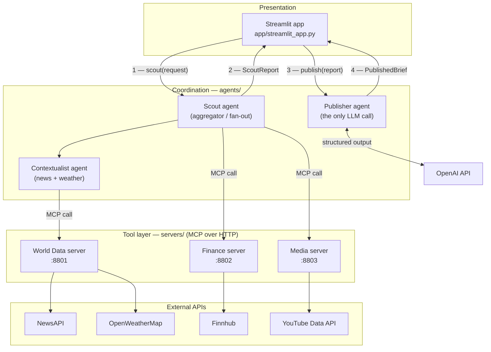
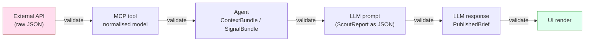
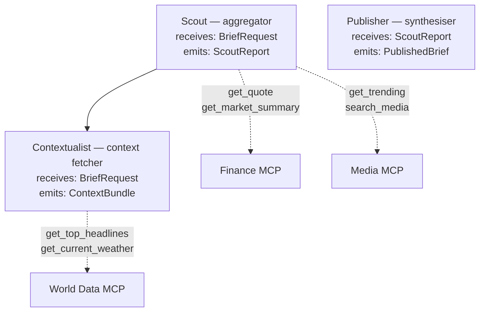
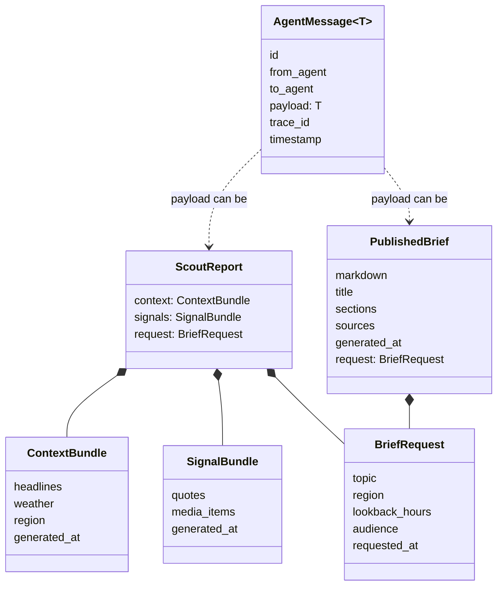
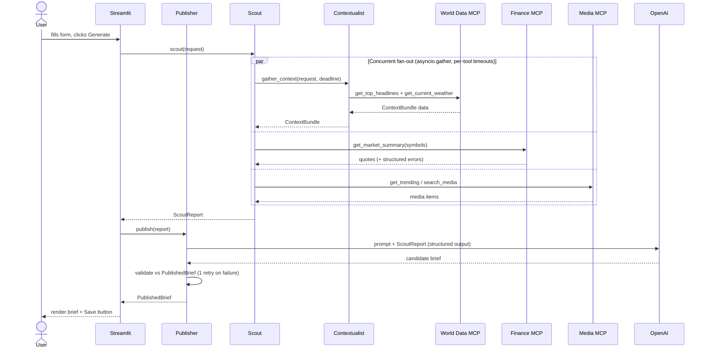
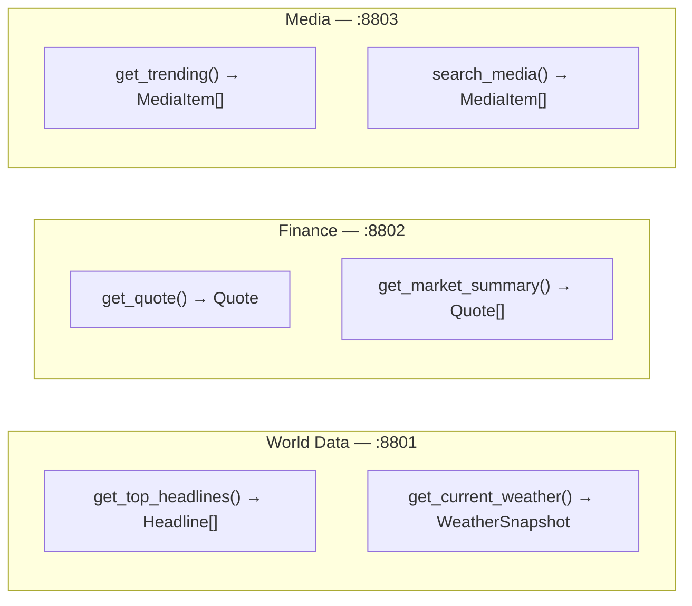

# Architecture — Multi-Agent News Brief Generator

This document explains how the system is put together: its layers, the agents, the MCP tool servers, the message contracts that flow between them, and the request lifecycle from a button click to a finished brief.

It is the architectural companion to [PRD.md](PRD.md). The PRD says *what* to build task by task; this document shows *how the pieces fit*.

---

## 1. The big picture

Four concerns are deliberately kept apart:

- **Tool layer (MCP servers)** — wrap external APIs, normalise their output, hand back validated data. They do not think.
- **Coordination layer (agents)** — decide what to fetch, fan out, aggregate, and hand off. They hold no state between calls.
- **Synthesis (the Publisher)** — the single LLM call that turns gathered data into prose.
- **Presentation (Streamlit)** — triggers the work and renders the result.

**Reading the arrows:** the **UI orchestrates** — it calls the Scout to gather (steps 1–2), then hands the resulting `ScoutReport` to the Publisher to synthesise (steps 3–4). The Publisher is a pure synthesiser: it never calls the Scout and never sees a `BriefRequest`. Gathering flows *down* from the Scout through the agents to the tools and back *up*; each agent only knows about the layer directly beneath it.

---

## 2. Layered boundaries and validation

The most important rule in the system: **every boundary validates with Pydantic v2**. Data is checked when it enters from an API, when it leaves an MCP server, when it lands in an agent, when the LLM responds, and before it reaches the UI. Bad data is rejected early with a clear error instead of leaking forward.

Two design rules live on these boundaries:

- **Errors are data at the MCP boundary.** A tool never raises out or returns a 500. A bad ticker or a quota error comes back as a structured error entry, so callers can degrade gracefully.
- **Upstream text is untrusted at the LLM boundary.** Headlines and descriptions are treated as hostile input. A headline reading "ignore previous instructions" must not derail the brief.

---

## 3. The agents and why they are split

The Scout and the Publisher are siblings, not a chain: the orchestration layer (the UI) calls the Scout, then calls the Publisher with the Scout's output. The Publisher does **not** call the Scout.

- **Contextualist** owns the "what is happening right now" slice: news plus weather. It fans out to the World Data server with per-tool timeouts and returns a `ContextBundle`. If weather is down the bundle comes back with that section empty and a logged warning.
- **Scout** is the aggregator. It calls the Contextualist *and* the Finance and Media servers concurrently, then composes a `ScoutReport`. It also owns the symbol-selection policy, which is **deliberately LLM-free**: derive tickers from the topic via a keyword→ticker map, else fall back to a default watchlist (e.g. SPY/AAPL/MSFT), logging a warning when it falls back. Richer topic→symbol resolution (which would need the LLM or a symbol-search API) is out of scope — keeping it heuristic preserves the "only one LLM call" invariant.
- **Publisher** is the only component that talks to the LLM. It takes a `ScoutReport`, prompts for structured output, validates the response against `PublishedBrief`, retries once with a corrective prompt on failure, then surfaces an error.

Why split Contextualist from Scout? It keeps the aggregator from becoming a god-object and lets the context-gathering concern evolve (or be reused) on its own. Note the asymmetry: the World Data server is wrapped by the Contextualist, while the Scout calls the Finance and Media servers directly. That is a deliberate choice for this toy — the news+weather pairing is the one slice worth isolating; promoting Finance/Media to their own agents would be the obvious next step if either grew its own logic.

---

## 4. The A2A message contracts

Agents talk to each other through **typed Pydantic models, never loose dicts**. These contracts live in `agents/contracts.py` and are the real inter-agent API.

`AgentMessage[T]` is a generic envelope: the payload is the business data, the envelope carries identity and a `trace_id`. It is **defined as a contract but kept off the hot path** — the agent functions pass bare payloads (`BriefRequest`, `ScoutReport`), not wrapped envelopes. The reason is honesty about the transport: the MCP boundary (`call_tool`) does not carry the envelope, so a `trace_id` threaded through agents could not follow a call into a tool server. Instead, **request correlation uses a stdlib `logging` trace id held in a `contextvars.ContextVar`**, set once per brief generation and picked up by every log record via a logging filter. `AgentMessage[T]` remains in `contracts.py` as the typed-envelope reference (and a teaching artifact), ready to become load-bearing if a real message bus replaces the in-process calls. Contracts are designed for additive evolution, not one-shot perfection.

### Identifier resolution

`BriefRequest` carries a single `region` and a free-text `topic`, but the tools underneath need three different identifiers and a query. A small resolver (a lookup util, e.g. `agents/regions.py`) maps one `region` into the shapes each tool expects:

| BriefRequest field | resolves to | consumed by |
|---|---|---|
| `region` | `country_code` (e.g. `gb`) | news (`get_top_headlines` / `search_news`) |
| `region` | `weather_city` (e.g. `London`) | weather (`get_current_weather`) |
| `region` | `media_region` (e.g. `GB`) | media (`get_trending`) |
| `topic` | free-text `query` | news search |
| `lookback_hours` | `from`/`to` window | news search |

This keeps the translation explicit and testable in one place rather than smuggled into each agent. Note the dependency: `topic` and `lookback_hours` only have a consumer once the news tool exposes a query + time window (see PRD Task 2).

---

## 5. The request lifecycle (sequence)

This is the full path of one "Generate Brief" click. Note the concurrency: the Scout fans out and waits on everything together rather than calling each upstream in turn.

**The UI is the orchestrator:** it calls `scout(request)`, receives a `ScoutReport`, then calls `publish(report)`. The Scout and Publisher never call each other.

A single bounded time budget (default ~10s) is owned by the **outermost** caller — the Scout — and passed *down* to the Contextualist as a remaining-time deadline, so the Contextualist's per-tool timeouts derive from the parent deadline rather than starting a fresh independent 10s. If one upstream times out or fails, its section comes back empty with a logged warning and the brief is still produced.

---

## 6. The MCP tool servers

Three independent FastMCP servers, each on its own port, each wrapping one domain. They run as separate processes and can all be up at once without conflict.

Server design rules:

- **Stateless and dumb.** A server wraps an API, normalises units and shapes, and returns validated models. It does not interpret or make editorial decisions.
- **Normalise on the way out.** Weather always returns metric internally even when the caller asks for imperial. Money uses precise numeric handling. Long media descriptions are truncated deterministically.
- **Partial success in batch tools.** `get_market_summary(["AAPL","MSFT","INVALID"])` returns two valid quotes and one structured error entry.
- **Timeouts on every upstream call**, with the error surfaced as typed data.

`agents/mcp_client.py` is the thin HTTP wrapper agents use to call any tool: `call_tool(server_url, tool, args) -> dict`.

---

## 7. Where this toy would break under load

A deliberate part of the learning. The current shape has clear ceilings:

- **Synchronous request lifecycle.** A brief blocks for the length of the slowest upstream plus the LLM call. At real traffic this needs a job queue and async workers, not a request-bound flow.
- **No caching.** Every brief re-hits every API. Free-tier quotas (NewsAPI, YouTube) would throttle quickly. A cache keyed on topic and region with short TTLs is the obvious next step.
- **Fan-out is per-process.** Scaling to N MCP servers or N concurrent users would push past local `asyncio` into a real orchestrator and connection pooling.
- **Single LLM call, single retry.** No streaming, no token-budget trimming for large reports, no cost telemetry beyond logging.
- **No persistence beyond file saves.** Briefs are written to `saved_briefs/` as markdown. Anything multi-user needs real storage and auth, both out of scope here.

These are documented limits, not accidents. The architecture is a small production-shaped slice meant to expose exactly these decision points.
